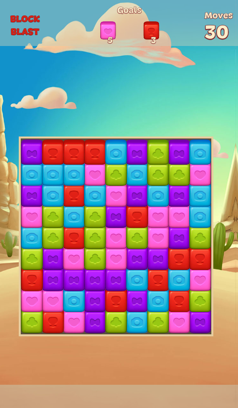

## 📋 Match3 Game
A match-3 game is a type of puzzle video game where the primary objective is to match at least three identical items, symbols, or colors in a row or column. These games are usually played on a grid-based board where players can swap adjacent items to make matches.
  

## 🖼️ Screenshots

  
